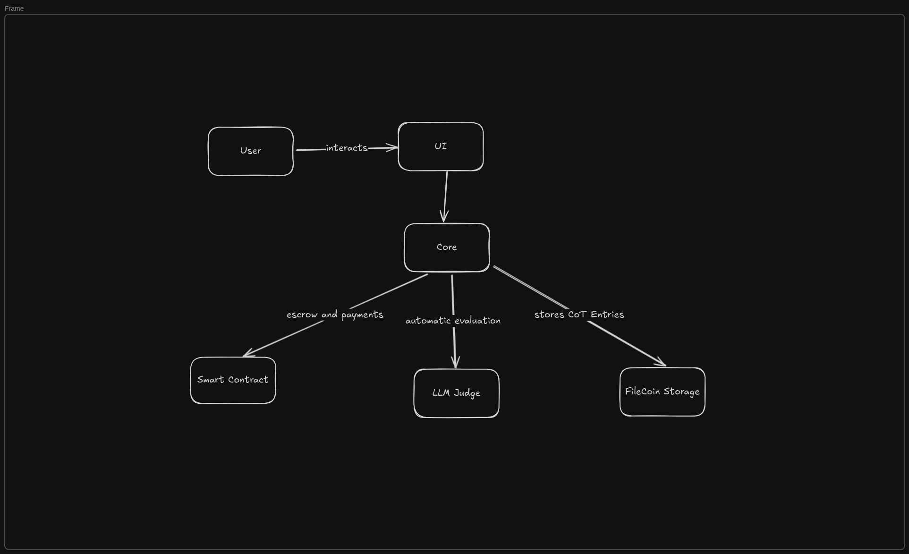

# Odin

A bounty marketplace for developers to participate in and earn rewards for completing AI agent bounties.

## Overview
Odin is a decentralized platform connecting organizations with developers through AI-focused bounties. The platform enables seamless submission, evaluation, and reward distribution for AI agent tasks, while building a valuable public dataset for advancing AI research.
### Features
- Open Bounty Marketplace: Browse, filter, and participate in a wide range of AI agent development challenges
- Automated Evaluation: Objective assessment of submissions using predefined metrics and test cases
- Smart Contract Integration: Secure escrow-based payment system using blockchain technology
- Public Dataset: All successful submissions contribute to an open repository for AI research
- Organization Dashboard: Easy bounty creation and management for companies and research groups

## Core Components and Architecture

UI

- React-based SPA with TypeScript
- Web3 integration for wallet connection
- Real-time notifications for bounty updates
- Code submission and testing interface

Backend

- Node.js server with Fastify
- PostgreSQL for data persistence
- Authentication via Web3

Evaluation Engine

- AI agent for evaluating outputs
- Secure submission via AES-256 encryption with blockchain-based signing

Dataset Management

- Automated aggregation of successful solutions
- Standardized formatting for research accessibility
- Version control and lineage tracking

## Future Plans

- Successful Integration of UI and Backend
- More Sophisticated Evaluation Engine (via MCP servers)
- Smart Contract Integration
- Decentralized DB Integration